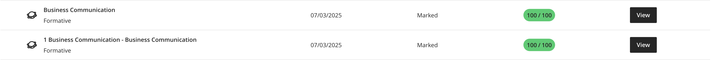

# Asanda Thabiso Ndhlela – PRP370S Digital Portfolio

**Student Number:** 230614345
**Subject:** Project Presentation 3 (PRP370S)
**Date:** 18 October 2025

---

### 📎 Related Assessment Documents

* [Assessment Cover Page](documents/assessment-cover.md)
* [Digital Portfolio Rubric](documents/portfolio-rubric.md)

---

## 🎯 Career Counseling (Business Communication)

**Completed:** “Work Readiness: Business Communication” module on Blackboard

### 🔍 Reflection (STAR Technique)

**Situation:**
As a final-year ICT student, I needed to strengthen my professional communication skills to prepare for the workplace.

**Task:**

* Understand professional business communication standards
* Practice effective email and report writing
* Improve verbal communication for presentations

**Action:**

* Completed Blackboard activities on workplace communication
* Composed mock professional emails and practice presentations
* Received peer and lecturer feedback on tone and structure

**Result:**

* **Improved Clarity:** My written and verbal communication became more concise and professional.
* **Confidence Boost:** I can now confidently present and respond to professional correspondence.

📎 **Evidence:**

🧩 **Reflection:**
This module improved my understanding of professional etiquette and helped me adopt a positive communication style in academic and work environments.

---

## 💻 Skills Development (Interview Skills & Mock Interview)

**Completed:** Interview Preparation & Mock Interview on Blackboard

### 🔍 Reflection (STAR Technique)

**Situation:**
I recognized that I needed to develop my interview skills to succeed in applying for internships and entry-level ICT positions.

**Task:**

* Learn effective interview techniques
* Practice answering behavioral questions using STAR
* Participate in a mock interview and receive feedback

**Action:**

* Completed online “Interview Skills” module and mock interview session
* Recorded responses and reviewed lecturer feedback
* Practiced with sample ICT-related interview questions

**Result:**

* **Preparedness:** I can confidently answer both technical and situational questions.
* **Self-Awareness:** Identified areas for improvement like time management and self-presentation.

📎 **Evidence:**

🧩 **Reflection:**
The mock interview helped me gain practical insight into real-world interview expectations and how to apply the STAR technique effectively.

---

## 🧠 Personality Assessment (Professional Networking)

📎 **Evidence:**

### 🔍 Reflection (STAR Technique)

**Situation:**
While working in group projects, I realized how different personalities influence collaboration and teamwork.

**Task:**
Identify my personality type and understand how it affects workplace interactions.

**Action:**
Completed a personality and networking strengths assessment on Blackboard. Compared results with classmates to analyze team dynamics.

**Result:**

* **Improved Collaboration:** I now adapt my communication approach to different personality types.
* **Professional Growth:** I learned to maintain a balance between assertiveness and active listening.

🧩 **Reflection:**
This activity improved my emotional intelligence and understanding of how professional networking contributes to teamwork and leadership.

---

## 📄 Curriculum Vitae (Workplace Etiquette)

📎 **Evidence:**

[View My CV](PRP_Assignment/Work-Readiness-Portfolio/artefacts/Asanda_Ndhlela CV.pdf)

### 🔍 Reflection (STAR Technique)

**Situation:**
I needed a professional CV that aligns with current ICT industry expectations.

**Task:**
Develop an ATS-friendly and visually appealing CV to apply for internships.

**Action:**

* Followed Blackboard CV workshop guidance
* Used a clean, structured CV template
* Highlighted projects, technical skills, and achievements

**Result:**

* **Professional Presentation:** My CV now clearly reflects my technical and soft skills.
* **Positive Feedback:** Received acknowledgment from peers and lecturer for clarity and structure.

🧩 **Reflection:**
This activity improved my ability to communicate qualifications and achievements effectively through professional documentation.

---

## 💼 Job Application & Interview Prep (Workplace Readiness)

📎 **Evidence:**

### 🔍 Reflection (STAR Technique)

**Situation:**
As graduation approaches, I must prepare for the transition into professional employment.

**Task:**

* Apply for internship and junior developer roles
* Strengthen LinkedIn and GitHub presence
* Prepare for behavioral and technical interviews

**Action:**

* Optimized my LinkedIn profile with project links and certifications
* Applied to multiple ICT internship opportunities
* Practiced interview responses using Blackboard materials

**Result:**

* **Professional Readiness:** Developed confidence and consistency in applications.
* **Industry Insight:** Gained a better understanding of how to align academic projects with job requirements.

🧩 **Reflection:**
The application process reinforced my understanding of persistence and professional communication. I can now confidently connect my academic achievements to real-world job expectations.

---

## 🧾 Summary

| Category                | Achievement                                | Evidence                           |
| ----------------------- | ------------------------------------------ | ---------------------------------- |
| Business Communication  | Completed Work Readiness Communication     | business-communication.png         |
| Interview Skills        | Completed Mock Interview & STAR reflection | mock-interview.png                 |
| Professional Networking | Understood team collaboration styles       | personality-assessment.png         |
| CV Creation             | Developed professional CV                  | cv-feedback.png                    |
| Interview Preparation   | Improved readiness for ICT job market      | linkedin.png, job-applications.png |

---

### ✅ Final Reflection

This PRP370S Digital Portfolio reflects my growth in professional communication, self-awareness, and workplace readiness. Through business communication practice, mock interviews, and networking activities, I have strengthened both technical and interpersonal competencies required for success in the ICT industry.
